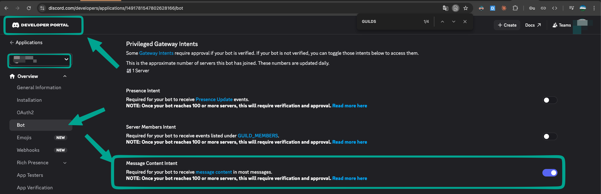
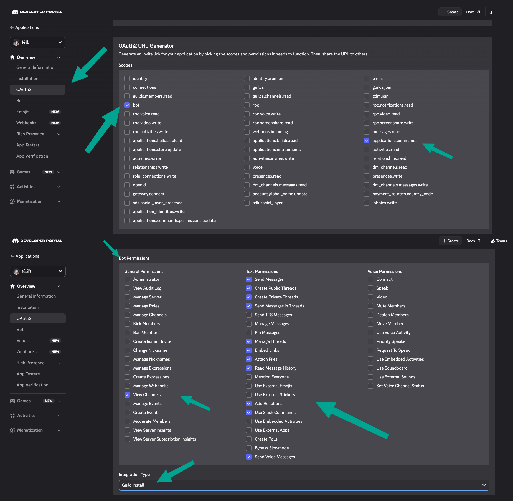

# Quill

[](https://go.dev/)
[](LICENSE)
[](https://github.com/neilkuan/quill/pkgs/container/quill)

[繁體中文](README-zh-tw.md) | English

A lightweight, secure, cloud-native **ACP (Agent Client Protocol) bridge** that connects **Discord**, **Telegram**, and **Microsoft Teams** with any ACP-compatible coding CLI — [Kiro CLI](https://kiro.dev), [Claude Code](https://docs.anthropic.com/en/docs/claude-code), [Codex](https://github.com/openai/codex), [GitHub Copilot CLI](https://github.com/github/copilot-cli), and more.

This is a **Go rewrite** of [openab](https://github.com/openabdev/openab) (originally in Rust).

---

##### Features

- **Pluggable agent backends** — Kiro, Claude Code, Codex, GitHub Copilot (any ACP-compatible CLI)
- **Discord integration** — @mention triggers, auto thread creation, multi-turn conversations
- **Telegram integration** — @mention / reply-to-bot in groups, private chat, voice auto-accepted in groups, forum topic support (one session per topic)
- **Microsoft Teams integration** — @mention trigger in channels, Bot Framework webhook, streaming edit responses, image/voice/file attachments
- **Voice message transcription** — transcribes voice messages via OpenAI Whisper API (Discord, Telegram & Teams)
- **Real-time edit streaming** — updates messages as the agent works (Discord: 1.5s, Telegram: 2s)
- **Emoji status reactions** — processing progress via platform-native reactions
- **Interrupt mid-reply** — `/stop` command or tap-to-cancel 🛑 reaction on Discord; session stays alive, context preserved (ACP `session/cancel` with watchdog fallback)
- **Session pool** — one CLI process per thread/chat, automatic lifecycle management
- **Session management** — bot commands (`sessions`/`reset`/`info`/`resume`/`stop`), LRU eviction, HTTP API for monitoring
- **ACP protocol** — JSON-RPC over stdio
- **Kubernetes ready** — includes Dockerfile for containerized deployment

---

##### Pluggable Agent Backends

Supports Kiro CLI, Claude Code, Codex, GitHub Copilot CLI, and any ACP-compatible CLI.

| Agent key | CLI | ACP Adapter | Auth |
|---|---|---|---|
| `kiro` (default) | Kiro CLI | Native `kiro-cli acp` | `kiro-cli login --use-device-flow` |
| `codex` | Codex | [@zed-industries/codex-acp](https://github.com/zed-industries/codex-acp) | `codex login --device-auth` |
| `claude` | Claude Code | [@agentclientprotocol/claude-agent-acp](https://github.com/agentclientprotocol/claude-agent-acp) | `claude auth login` or `claude setup-token` |
| `copilot` ⚠️ | GitHub Copilot CLI | Native `copilot --acp --stdio` | `gh auth login -p https -w` |

> ⚠️ **copilot**: Requires a paid GitHub Copilot subscription. ACP support is currently in public preview — behavior may change.

---

##### Platform Support

| Platform | Text | Image | Voice | Status |
|----------|------|-------|-------|--------|
| Discord  | ✅   | ✅    | ✅    | Available |
| Telegram | ✅   | ✅    | ✅    | Available |
| ⚠️ Teams    | ✅   | ✅    | ✅ (STT) | **Experimental / Beta** |

> ⚠️ **Experimental / Beta:** The **Microsoft Teams adapter** and the **Helm chart** (`deploy/helm/quill`) are still in beta. Interfaces, config keys, and chart values may change without notice. Use at your own risk in production.

---

##### Architecture

```
  _________________                ___________________________                 ______________
 |                 |   message    |                           |   JSON-RPC    |              |
 |    Discord      |------------->|     Platform Adapter      |<------------->|  ACP Agent   |
 |    Telegram     |<-------------|   (handler | reactions)   |     stdio     |  (subprocess)|
 |   MS Teams      |   reply      |             |             |               |              |
 |_________________|              |             v             |               |   kiro-cli   |
                                  |   command.ParseCommand    |               |   claude-acp |
                                  |  sessions | info | reset  |               |   codex-acp  |
                                  |  resume   | stop (cancel) |               |   copilot    |
                                  |             |             |               |______________|
                                  |             v             |
                                  |       SessionPool         |
                                  |   LRU | TTL | per-thread  |
                                  |             |             |
                                  |             v             |
                                  |      AcpConnection        |
                                  |   prompt | cancel | wd    |
                                  |___________________________|
                                        |                |
                              optional  |                |  optional
                                        v                v
                                  _____________     _____________
                                 |             |   |             |
                                 |   STT/TTS   |   |  HTTP API   |
                                 |  (Whisper | |   |  (sessions  |
                                 |   OpenAI |  |   |   health)   |
                                 |   Gemini)   |   |_____________|
                                 |_____________|
```

**Data flow (text)**: user message -> platform adapter -> command parser (slash / text) -> SessionPool (one AcpConnection per thread key) -> JSON-RPC over stdio -> agent CLI subprocess. Streamed notifications flow back the same way, edited into the originating bot message every 1.5-2s.

**Cancel path**: user `/stop` or 🛑 reaction -> `AcpConnection.SessionCancel()` sends a `session/cancel` notification on a goroutine distinct from the prompt (no promptMu). Agent replies with `stopReason="cancelled"`; if the agent ignores cancel, a 10s watchdog synthesizes the same response so the stream never hangs.

---

##### Quick Start

```bash
# Clone
git clone https://github.com/neilkuan/quill.git
cd quill

# Copy and edit config
cp config.toml.example config.toml
# Edit config.toml with your Discord bot token and channel IDs

# Run
go run . config.toml
```

##### Configuration

Configuration uses TOML with environment variable expansion (`${VAR_NAME}` syntax):

```toml
[discord]
bot_token = "${DISCORD_BOT_TOKEN}"
allowed_channels = ["1234567890"]
# allowed_user_id = ["*"]                    # wildcard: any user
# allowed_user_id = ["823367235137044491"]   # or specific Discord user IDs

[telegram]
bot_token = "${TELEGRAM_BOT_TOKEN}"
allowed_chats = [-100123456789]
# allowed_user_id = ["*"]             # wildcard: any user
# allowed_user_id = ["123456789"]     # or specific Telegram user IDs (as strings)

[teams]
app_id = "${TEAMS_APP_ID}"
app_secret = "${TEAMS_APP_SECRET}"
tenant_id = "${TEAMS_TENANT_ID}"
listen = ":3978"
# allowed_user_id = ["*"]             # wildcard: any user
# allowed_user_id = ["29:user-id"]    # or specific Teams user IDs

[agent]
command = "kiro-cli"
args = ["acp", "--trust-all-tools"]
working_dir = "/home/agent"

[pool]
max_sessions = 10
session_ttl_hours = 24

[discord.reactions]
enabled = true
remove_after_reply = false
```

##### User allowlist (`allowed_user_id`)

`allowed_user_id`, when set on a platform section, **takes precedence** over `allowed_channels` (Discord / Teams) / `allowed_chats` (Telegram): only the listed users can trigger the bot, from **any** channel or chat. When unset, the existing channel/chat gate is used unchanged. `["*"]` is a wildcard that allows any user.

Matching is against the numeric user ID, not the username — usernames can change, IDs can't.

###### How to find a user's Discord ID

- **From the app:** Enable Developer Mode (`User Settings → Advanced → Developer Mode`), then right-click a user → **Copy User ID**.
- **From logs:** Run with `QUILL_LOG=debug`, send the bot a message, and look for the `author_id=...` field in the `discord message received` log line.

###### How to find a user's Telegram ID

- **From Telegram:** message [@userinfobot](https://t.me/userinfobot), it replies with your numeric ID.
- **From logs:** run with `QUILL_LOG=debug`, send the bot a message, and look for `user_id=...` in the `telegram update` log line.

Telegram IDs go in quotes in TOML (`["123456789"]`, not `[123456789]`) so `"*"` can coexist with numeric IDs in the same array.

##### STT — Speech-to-Text (Optional)

To enable voice message support, add a `[stt]` section with an OpenAI API key:

```toml
[stt]
api_key = "${OPENAI_API_KEY}"
# provider = "openai"       # default
# model = "whisper-1"       # default
# language = "zh"           # ISO-639-1 code, default "zh"
# prompt = "以下是繁體中文語音的逐字稿："  # hint for Traditional Chinese output
```

When configured, voice messages (Discord & Telegram) are automatically transcribed and sent to the agent as text. Without this config, voice-only messages return a warning to the user.

##### TTS — Text-to-Speech (Optional)

To enable voice replies, add a `[tts]` section with an OpenAI API key:

```toml
[tts]
api_key = "${OPENAI_API_KEY}"
# model = "tts-1"           # or "tts-1-hd", "gpt-4o-mini-tts"
# voice = "nova"            # alloy, ash, ballad, coral, echo, fable, nova, onyx, sage, shimmer, verse, marin, cedar
# voice_gender = "female"   # "female" (default, nova) or "male" (ash) — used when voice is not set
```

When configured, the bot sends a voice message alongside text replies when the user sends a voice message. Powered by OpenAI TTS API.

##### Voice Pricing (OpenAI)

| Service | Model | Price |
|---------|-------|-------|
| **STT** | `whisper-1` | $0.006 / min |
| **STT** | `gpt-4o-mini-transcribe` | $0.003 / min |
| **STT** | `gpt-4o-transcribe` | $0.006 / min |
| **TTS** | `tts-1` | $15.00 / 1M chars |
| **TTS** | `tts-1-hd` | $30.00 / 1M chars |
| **TTS** | `gpt-4o-mini-tts` | $0.015 / min |

A typical chatbot voice reply (~300 chars) costs about **$0.0045** with `tts-1`. Pricing as of 2026, see [OpenAI pricing](https://openai.com/api/pricing/) for latest.

See [`config.toml.example`](config.toml.example) for the full reference including alternative agents (Claude, Codex).

---

##### Session Management

Built-in bot commands and HTTP API for managing agent sessions.

###### Bot Commands

Commands are registered as native platform commands — Discord Slash Commands and Telegram BotCommands — so they appear in the `/` autocomplete menu. Plain text (e.g., `@bot sessions`) is also supported as fallback.

| Command | Description |
|---------|-------------|
| `/sessions` | List all active sessions with stats |
| `/info` | Show current thread/chat session details |
| `/reset` | Kill current session (new one on next message) |
| `/resume` | Attempt to restore a previous session for this thread |
| `/stop` | Interrupt the agent's current reply (session kept alive). `cancel` is an alias. On Discord, tapping the 🛑 reaction on a streaming message has the same effect. |
| `/pick` | Browse and load historical agent sessions. Without args (or with `all`), Discord replies with a select menu and Telegram with an inline keyboard — tap to resume. `/pick <N>` loads the Nth entry from the previous listing, `/pick load <id>` loads by session ID (text paths kept for power users). `/pick all` skips the cwd filter. `history`, `session-picker`, `session_picker`, and `sessionpicker` are legacy aliases. |
| `/mode` | List or switch the session's agent mode (ACP `session/set_mode`). With no argument, Discord replies with a select menu and Telegram with an inline keyboard so users can tap to pick. `/mode <id>` or `/mode <N>` switches directly. Only works once an active session exists in the thread (send a message first if needed). Requires the agent to advertise a `modes` object during session setup. |
| `/model` | List or switch the session's LLM model (ACP `session/set_model`). Same UX as `/mode` — interactive on Discord / Telegram, text-only on Teams. Requires the agent to advertise a `models` object during session setup. |

Every agent reply also carries a small footer showing the session's current mode and model — e.g. `— mode: `卡卡西` · model: `claude-sonnet-4.6`` — so users know which persona and backend produced the answer without running `/info`. The footer is omitted when the agent advertises neither.

###### HTTP API (Optional)

Enable in config:

```toml
[api]
enabled = true
listen = ":8080"
```

| Endpoint | Method | Description |
|----------|--------|-------------|
| `/api/health` | GET | Health check with pool stats |
| `/api/sessions` | GET | List all sessions as JSON |
| `/api/sessions/{key}` | DELETE | Kill a specific session |

###### Pool Behavior

- **LRU eviction** — when pool is full, the least recently used session is evicted automatically
- **TTL cleanup** — idle sessions are cleaned up after `session_ttl_hours` (default: 24h)
- **Per-session stats** — created time, last active, message count

###### Session History (`/pick`)

The `/pick` command lets users browse and resume an agent's historical sessions directly from chat. The picker reads each agent's on-disk session store — the agent process does not need to be running:

| Agent | Session storage | cwd filter |
|---|---|---|
| Kiro CLI | `~/.kiro/sessions/cli/<uuid>.{json,jsonl}` | ✅ |
| Claude Code | `~/.claude/projects/<encoded-cwd>/<uuid>.jsonl` | ✅ |
| GitHub Copilot CLI | `~/.copilot/session-state/<uuid>/` (`workspace.yaml` + `events.jsonl`) | ✅ (best-effort from `workspace.yaml`) |
| Codex | `~/.codex/history.jsonl` (flat index) | ❌ — Codex's history entries carry no cwd. `List` returns an empty slice when a non-empty cwd is passed, rather than silently returning unfiltered results |

When Codex sessions are displayed, the picker UI will surface a note about the missing cwd filter so users know to drop the cwd argument to see any results.

---

##### Platform Comparison

| | Discord | Telegram | Teams |
|---|---|---|---|
| **Trigger (channel/group)** | @mention or in-thread | @mention, reply-to-bot, or voice message | @mention |
| **Trigger (DM/private)** | — | All messages | All messages |
| **Thread model** | Auto-creates Discord threads | One session per chat; forum supergroups get one session per topic | One session per conversation |
| **Message limit** | 2,000 chars | 4,096 chars | 28,000 chars |
| **Edit streaming interval** | 1.5s | 2s (Telegram rate limit is stricter) | 2s |
| **Markdown** | Native GFM support | `**bold**` auto-converted to `*bold*` (Telegram Markdown v1) | Native GFM support |
| **Status reactions** | Add/remove per emoji | `setMessageReaction` replaces all (one emoji at a time) | Typing indicator |
| **Voice in groups** | Requires @mention | Auto-accepted (can't @mention while recording) | STT transcription on audio attachments |
| **Image handling** | Download from CDN by URL | Download via Bot API `getFile` (largest PhotoSize) | Download from `contentUrl` with bearer token |
| **Bot library** | [discordgo](https://github.com/bwmarrin/discordgo) | [go-telegram/bot](https://github.com/go-telegram/bot) | Custom (Bot Framework REST API) |
| **Update mechanism** | WebSocket gateway | Long polling | HTTP webhook (`POST /api/messages`) |

##### Discord Setup Notes

1. Create an application and bot at the [Discord Developer Portal](https://discord.com/developers/applications) and copy the **bot token**
2. Enable the required **Privileged Gateway Intents** on the bot page (see table below)
3. Invite the bot to your server using the OAuth2 URL Generator with the scopes and permissions listed below
4. Get the channel/thread ID: enable Developer Mode (`User Settings → Advanced → Developer Mode`), right-click a channel → **Copy Channel ID**, then add it to `allowed_channels` in your config

###### Required Gateway Intents

Configured in `discord/adapter.go`:

| Intent | Privileged? | Why |
|---|---|---|
| `GUILDS` | No | Guild/channel lifecycle events |
| `GUILD_MESSAGES` | No | Receive messages in guild channels and threads |
| `MESSAGE_CONTENT` | ✅ **Yes** | Read raw message content (required to parse prompts and @mentions) |
| `GUILD_MESSAGE_REACTIONS` | No | Receive reaction-add events for the tap-to-cancel 🛑 flow |

> ⚠️ `MESSAGE_CONTENT` is a **privileged intent** — you must toggle it on in the Developer Portal (**Bot → Privileged Gateway Intents → Message Content Intent**). Bots in 100+ servers also require Discord approval.
>
> Existing deployments upgrading across versions that added `GUILD_MESSAGE_REACTIONS` may need to **re-invite the bot** for the new intent to take effect.



###### Required OAuth2 Scopes

Select both scopes on the **OAuth2 → URL Generator** page:

| Scope | Why |
|---|---|
| `bot` | Standard bot install scope |
| `applications.commands` | Register Slash Commands (`/sessions`, `/info`, `/reset`, `/resume`, `/stop`, `/pick`, `/mode`, `/model`) via `ApplicationCommandCreate` |

###### Required Bot Permissions

Select these under **Bot Permissions** on the same page (permission integer: `397284474944`, adjust as needed):

| Permission | Why |
|---|---|
| View Channels | Receive messages in allowed channels |
| Send Messages | Post replies and the `💭 thinking...` placeholder |
| Send Messages in Threads | Stream replies inside auto-created threads |
| Create Public Threads | `MessageThreadStartComplex` — auto-creates a thread per prompt outside of existing threads |
| Manage Threads | Rename / archive threads the bot created |
| Embed Links | Render links and the session footer cleanly |
| Attach Files | `ChannelFileSend` for TTS voice replies (`voice_reply.mp3`) |
| Read Message History | Look up the originating message when editing streaming replies and resolving reactions |
| Add Reactions | `MessageReactionAdd` — status emojis (queued/thinking/tool/done) and the 🛑 tap-to-cancel affordance |
| Use Slash Commands | Invoke registered application commands in the server |



##### Telegram Setup Notes

1. Create a bot via [@BotFather](https://t.me/BotFather) and get the bot token
2. **Disable privacy mode** via BotFather (`/setprivacy` → Disable) so the bot receives @mentions in groups, then remove and re-add the bot to the group
3. Get the group chat ID: start the bot without `allowed_chats`, send a message in the group — the log will show `🚨👽🚨 telegram message from unlisted chat ... chat_id=XXXXX`
4. Add the `chat_id` to `allowed_chats` in your config

##### Teams Setup Notes

> ⚠️ **Beta:** Teams support is still experimental. Inbound JWT verification, attachment handling, and the Helm chart's ingress routing may evolve. Report issues at <https://github.com/neilkuan/quill/issues>.

1. Create an Azure Bot resource in [Azure Portal](https://portal.azure.com) — note the **App ID**, **App Secret**, and **Tenant ID**
2. Set the messaging endpoint to `https://<your-domain>/api/messages` (Quill listens on `:3978` by default)
3. Upload the app manifest to [Teams Developer Portal](https://dev.teams.microsoft.com/apps) — see `teams/appmanifest/README.md` for packaging instructions
4. Bots created via Developer Portal are **single-tenant** by default — Quill's auth flow uses the tenant-specific token URL

---

##### Docker

Four image variants are published for each release:

| Image | Agent |
|---|---|
| `ghcr.io/neilkuan/quill` | Kiro CLI |
| `ghcr.io/neilkuan/quill-claude` | Claude Code |
| `ghcr.io/neilkuan/quill-codex` | Codex |
| `ghcr.io/neilkuan/quill-copilot` | GitHub Copilot CLI |

```bash
docker run -v $(pwd)/config.toml:/etc/quill/config.toml \
  ghcr.io/neilkuan/quill:latest
```

##### Kubernetes (Helm)

> ⚠️ **Beta:** The Helm chart is experimental and primarily exercised on EKS with the AWS Load Balancer Controller. Values and templates may change between releases.

A Helm chart is included for EKS deployment (required for Teams webhook ingress):

```bash
helm install quill deploy/helm/quill \
  -n quill --create-namespace \
  --set instances.kiro.secrets.TEAMS_APP_ID="<app-id>" \
  --set instances.kiro.secrets.TEAMS_APP_SECRET="<secret>" \
  --set instances.kiro.secrets.TEAMS_TENANT_ID="<tenant>" \
  --set ingress.host="quill.example.com" \
  --set 'ingress.annotations.alb\.ingress\.kubernetes\.io/certificate-arn=arn:aws:acm:...'
```

The chart supports multi-instance deployment — run Kiro, Claude, and Codex in a single release. See [`deploy/helm/quill/README.md`](deploy/helm/quill/README.md) for details.

---

##### Development

###### Prerequisites

- Go 1.23+
- A Discord bot token with `MESSAGE_CONTENT` intent enabled, a Telegram bot token, and/or a Teams Azure Bot registration (App ID + App Secret)
- An ACP-compatible CLI installed (e.g., `kiro-cli`, `claude`, `codex`)

###### Build

```bash
go build -o quill .

# with version info
go build -ldflags "-X main.version=$(cat VERSION)" -o quill .
```

###### Run with debug logging

```bash
QUILL_LOG=debug ./quill config.toml
```

###### Project Structure

```
quill/
├── main.go              # Entry point: config, platform registration, graceful shutdown
├── platform/
│   └── platform.go      # Platform interface, shared message splitting
├── config/
│   └── config.go        # TOML config parsing, env var expansion, validation
├── acp/
│   ├── protocol.go      # JSON-RPC types, ACP event classification
│   ├── connection.go    # Child process management, stdio JSON-RPC, auto-permission
│   └── pool.go          # Session pool: get-or-create, LRU eviction, idle cleanup
├── command/
│   └── command.go       # Bot command parsing and execution (sessions/reset/info/resume/stop)
├── api/
│   └── server.go        # HTTP API server for session monitoring
├── stt/
│   └── stt.go           # Transcriber interface, OpenAI Whisper implementation
├── tts/
│   └── openai.go        # Synthesizer interface, OpenAI TTS implementation
├── discord/
│   ├── adapter.go       # Discord platform adapter (implements Platform interface)
│   ├── handler.go       # Discord message handler, thread creation, edit streaming
│   └── reactions.go     # Status reaction controller: debounce, stall detection
├── telegram/
│   ├── adapter.go       # Telegram platform adapter (implements Platform interface)
│   ├── handler.go       # Telegram message handler, mention/reply detection, edit streaming
│   └── reactions.go     # Telegram reaction controller via setMessageReaction API
├── teams/
│   ├── adapter.go       # Teams platform adapter (HTTP webhook server)
│   ├── auth.go          # Azure AD OAuth2 + JWT validation
│   ├── client.go        # Bot Framework REST API client
│   ├── handler.go       # Teams message handler, mention detection, ACP streaming
│   ├── types.go         # Bot Framework Activity types
│   └── appmanifest/     # Teams App Manifest, icons, packaging guide
├── deploy/
│   └── helm/quill/      # Helm chart for EKS deployment (multi-instance)
├── scripts/
│   └── release.sh       # Release automation (stable PR + RC tags)
├── Dockerfile           # Kiro CLI variant
├── Dockerfile.claude    # Claude Code variant
├── Dockerfile.codex     # Codex variant
├── Dockerfile.copilot   # GitHub Copilot CLI variant
├── config.toml.example  # Configuration reference
├── VERSION              # Semver version
└── RELEASING.md         # Release workflow documentation
```

###### Key Design Decisions

| Aspect | Choice | Why |
|---|---|---|
| Language | Go | Fast compile, single static binary, goroutine concurrency |
| Discord lib | [discordgo](https://github.com/bwmarrin/discordgo) | De facto Go Discord library |
| Telegram lib | [go-telegram/bot](https://github.com/go-telegram/bot) | Actively maintained, native forum topic support |
| Config format | TOML | Human-readable, same as original Rust version |
| Logging | `log/slog` (stdlib) | Zero dependency, structured logging |
| Concurrency | goroutines + `sync.Mutex` / `sync.RWMutex` | Idiomatic Go, no external async runtime needed |

---

##### Releasing

Releases follow a **"what you tested is what you ship"** philosophy using `scripts/release.sh`:

1. **Merge PRs to main** → `release.yml` auto-opens a Release PR (`release/v0.4.1`, only bumps `VERSION`)
2. **Create RC tag** → checkout release branch → `./scripts/release.sh --rc` → full build of 5 image variants x 2 platforms
3. **Merge the Release PR** → `tag-on-merge.yml` auto-tags stable → promotes pre-release images (no rebuild)

See [RELEASING.md](RELEASING.md) for the full workflow.

---

# License

[MIT](LICENSE)
