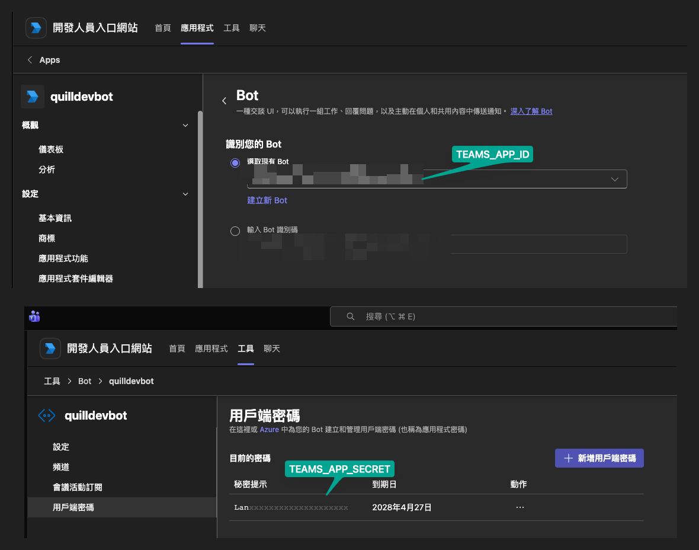

# Teams App Manifest

This directory contains the Teams app manifest and icons required for publishing to Microsoft Teams.

## Files

| File | Description |
|------|-------------|
| `manifest.json` | App manifest — replace `{{MICROSOFT_APP_ID}}` with your Azure AD App Registration ID |
| `color.png` | **192x192 px** full-color icon (PNG) — you must create this |
| `outline.png` | **32x32 px** white outline on transparent background (PNG) — you must create this |

## Setup

1. Replace `{{MICROSOFT_APP_ID}}` in `manifest.json` with your Azure Bot / App Registration ID
2. Create `color.png` (192x192) and `outline.png` (32x32 white+transparent)
3. Zip all three files into a `.zip` package:

```bash
cd teams/appmanifest
zip quill-teams.zip manifest.json color.png outline.png
```

4. Upload to [Teams Developer Portal](https://dev.teams.microsoft.com/apps) > Apps > Import app

## Azure Bot Registration

Before the manifest works, you need an Azure Bot resource:

1. Go to [Azure Portal](https://portal.azure.com) > Create "Azure Bot"
2. Note the **App ID** and **App Secret** (client secret)
3. Set the messaging endpoint to: `https://<your-domain>/api/messages`
4. Add these to your `config.toml`:

```toml
[teams]
app_id = "<App ID from Azure>"
app_secret = "<App Secret from Azure>"
tenant_id = "<Your Tenant ID>"
listen = ":3978"
```

## Where to find the credentials

If you registered the bot through the [Teams Developer Portal](https://dev.teams.microsoft.com/apps) (the modern UI that wraps Bot Framework + Azure Bot resource), the same values live here:



| `config.toml` key | Where to find it |
|---|---|
| `app_id` (`TEAMS_APP_ID`) | **Apps → quilldevbot → 應用程式功能 → Bot → 識別您的 Bot** (top dropdown). Same value as Azure Portal → App registration → **Application (client) ID**. Equals the `botId` field in `manifest.json`. |
| `app_secret` (`TEAMS_APP_SECRET`) | **工具 → Bot → quilldevbot → 用戶端密碼 → 新增用戶端密碼**. The full secret value is shown **only once at creation time** — copy it immediately. The portal afterwards only shows the prefix (e.g. `Lan…`) and expiry date. |
| `tenant_id` (`TEAMS_TENANT_ID`) | Azure Portal → **Microsoft Entra ID → Overview → Tenant ID**. Quill's auth uses tenant-specific token URLs, so a real tenant GUID is required (not `common`). |

> **Secret rotation**: client secrets expire (the example above expires 2028/4/27). Set a calendar reminder a couple of weeks before expiry — quill will start failing `/api/messages` validation the moment the old secret stops working.
